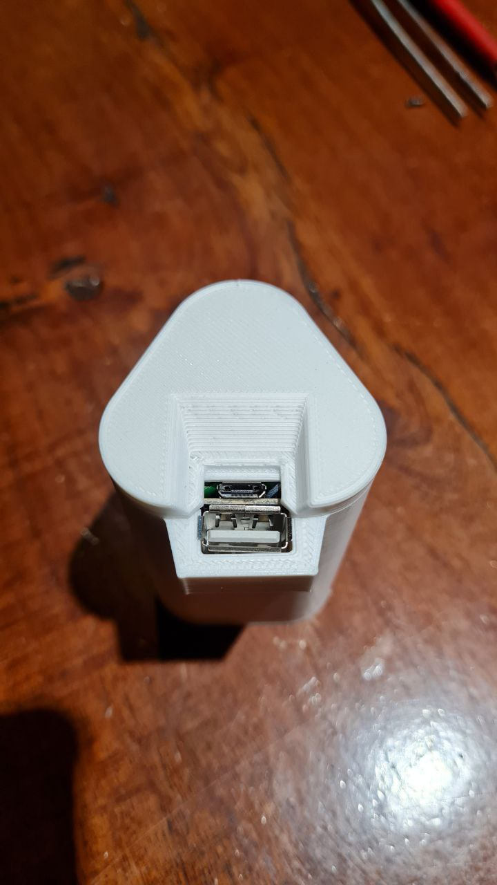

# Power Bank 3

Power bank 3 (aka pb3) is the easiest way to recycle notebook batteries. It is only necessary to buy a very cheap module, some welds and a two printed-3d parts.

If you want to modify the sketchup drawings, feel free to ask me

## Parts

- Tools: A tin, tin soldering iron and pliers
- Notebook battery or 3 18650 batterys
- Power bank module T6845-C 
- A wire to connect the batteries and the module
- 3d printed body and lid

|  |  |
| - | - | - |
|  |  |
|  | |

## Procedure

- Carefully disassemble the battery
- Separate the battery pack and assemble a new one with only 3 cells in parallel
- Solder two cables to the charging module in the same way as seen in the photo (you can leave them longer and cut them later)
- Solder the cables from the board to the battery packs so that they are on the side and on top
- Then place inside the case and place the lid (preferably glued)
- Put your new power bank to charge! and it's ready to use

|  |  |
|  |  |
|  |  |
|  |  |

 
